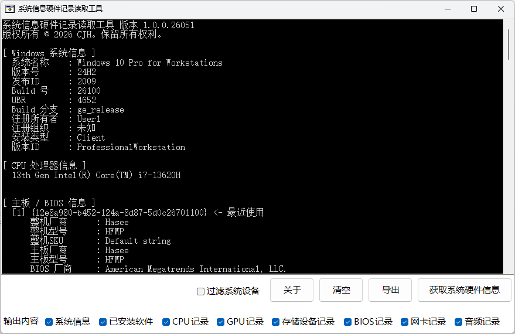

<h1 align="center">
  <a href="https://github.com/cjhdevact/HardWareInfo">HardWareInfo - 系统信息硬件记录读取工具</a>
</h1>

## 关于本项目

一个读取系统信息以及硬件使用记录的工具。

## 功能

本程序支持的功能有：

- [x] 读取电脑当前系统的系统信息
- [x] 安装的软件列表
- [x] 使用过的CPU记录
- [x] 使用过的GPU记录
- [x] 使用过的存储设备记录
- [x] 使用过的主板/BIOS记录
- [x] 使用过的网卡记录
- [x] 使用过的音频设备记录

## 下载

转到[发布页](https://github.com/cjhdevact/HardWareInfo/releases/latest)下载程序或源代码。

## 数字签名

本程序使用了自签证书进行了签名

证书信息：
```
Name: CJH Root Certificate
Create: ‎2024‎年‎12‎月‎27‎日 20:42:16
Expires: ‎2150‎年‎12‎月‎31‎日 0:00:00
MD5: 0bc507db70947e57ddd81bec63b581d9
SHA256: d2d67c8ebea3cc954c7ee0e94f5f45537dde7709053ca9e89f352fda60283
Key fingerprint (SHA1): 73b80a8d0ba3f662b575f2fc0b78612469e22e59
KeyID: d929e453f645017190dac5001a736a4d
Certificate SerialNumber: dbde77418068d5a34b2064626a12ecde
Key Type: md5RSA
```

你可以在[这里](Src/HardWareInfo/files/rootcert.cer)下载证书来验证程序完整性。

## 程序截图



## License

本程序基于`GNU GENERAL PUBLIC LICENSE Version 3`协议授权。